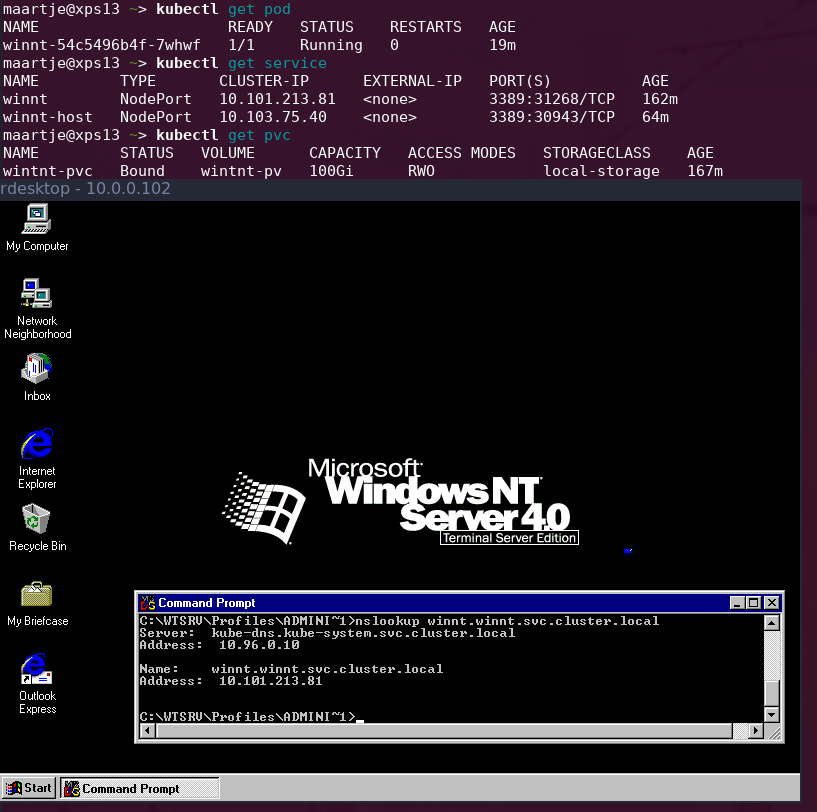

# Windows NT in Kubernetes

Yes I am crazy.

Old technology is always fun to play with, this one came out of the idea of building a retro computer lab.
However building one requires too much space on my desk.
So what if we put it inside the cloud? (well my baremetal "upcycle" cluster)

## Requirements
This will not work in traditional cloud environments unless you have nested virtualisation enabled.
You will also need to have root access to modify the kernel for Virtualbox, this is still the best option for Windows NT imo.

## Setup
This repository has my the Docker image i used inside `image/`, it installs VirtualBox as well as create a VM configuration.
The `manifests/` directory has the Kubernetes manifests I used, note that the PV one I use uses local PVs.

### The nodes
You have to set up the Virtualbox kernel modules inside the nodes, on how to do so without installing Virtualbox I's like to refer to [Jess Frazelle's dockerfiles](https://github.com/jessfraz/dockerfiles/blob/master/virtualbox/Dockerfile)

### The files
You will need 2 files inside your PV:
* `winnt.iso`: a Windows NT ISO, I use the Terminal Server edition so I can RDP into the server
* `winnt.vdi`: an empty disk, note this is Windows NT 4 it can be maximum 2GB. Can be created using `VBoxManage createhd --filename winntx.vdi --size 2000 --format VDI`

### The deployment
Inside manifests first deploy `service.yaml` and `pv.yaml`, then `deployment.yaml`.

You will now have 2 services `winnt-host` is a NodePort service for the Virtualbox RDP daemon. `winnt` forwards the RDP port to the VM itsef.
